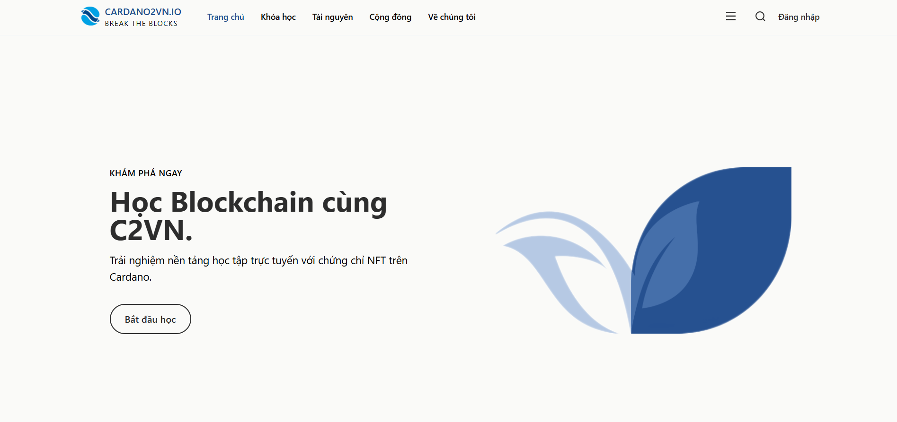

  

<h1 align="center">CARDANO2VN.IO</h1>

  <strong>Hệ thống quản lý học tập (LMS) của cộng đồng Cardano Việt Nam</strong>

---

  

---

## Giới thiệu

**C2VN LMS** là nền tảng học tập trực tuyến dành cho cộng đồng Cardano Việt Nam, nơi bạn có thể:

- Học các khóa học về Blockchain & Cardano
- Làm bài kiểm tra để đánh giá kiến thức
- Nhận chứng chỉ NFT khi hoàn thành khóa học
- Thanh toán bằng ADA

---

## Tính năng chính

| Tính năng | Mô tả |
|-----------|-------|
| **Khóa học** | Video bài giảng, tài liệu đọc, bài kiểm tra |
| **Quiz** | Câu hỏi trắc nghiệm, tự luận với công thức toán học |
| **Tiến độ** | Theo dõi tiến độ học tập theo thời gian thực |
| **Chứng chỉ** | NFT chứng nhận hoàn thành khóa học |
| **Ví Cardano** | Kết nối ví để thanh toán và nhận NFT |

---

## Đối tượng sử dụng

- Người mới bắt đầu tìm hiểu Blockchain
- Developer muốn học lập trình Smart Contract
- Cộng đồng Cardano Việt Nam

---

## Liên hệ

- Website: [cardano2vn.io](https://cardano2vn.io)
- Cộng đồng: Cardano2VN

---

  © 2025 Cardano2VN. All rights reserved.

